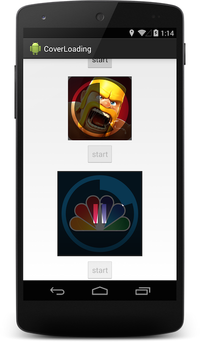

CoverLoading
============

Simulate ios installing app animation. It will progress when app is installing, when icon is clicked, a pause animation will start and progress stops. Also include a stop animation. CoverView is child of ImageView, so you can set a image to it.


It will also automatically scale for different image sizes.



How to use
==========

Include this to gradle

```gradle
    compile 'me.biubiubiu.coverloading:library:0.2.2'
```

Add view in xml

```xml
    <com.bettycc.coverloading.library.CoverView
        android:id="@+id/cover"
        android:layout_width="wrap_content"
        android:layout_height="wrap_content"
        android:layout_centerInParent="true"
        android:src="@drawable/cover"
        />
```

Set progress

```java
        mCoverView = (CoverView) findViewById(R.id.cover);
        mCoverView.setProgress(20);
```
Progress is in 0-100. When you set a progress to CoverView it will perform a animation and move progress. But when in the animation you set another progress, it will save the progress and move again when previous ended.

##Customization

```xml
    app:background="#cccccccc" //Change background color of cover.
    app:corner_radius="10dp" //Change the radius of corner. If your image is rectangle, then set it to 0dp.
```


##Callbacks

When use pause installing, this callback will be triggered.

```java
        mCoverView.setOnPauseResumeListener(new CoverView.OnPauseResumeListener() {
            @Override
            public void onPause() {
                Toast.makeText(MainActivity.this, "paused", Toast.LENGTH_SHORT).show();
            }

            @Override
            public void onResume() {
                Toast.makeText(MainActivity.this, "resumed", Toast.LENGTH_SHORT).show();
            }
        });
```

##Compatibility

Api 8 and above.
 
##Dependencies

- [nineoldandroids](https://github.com/JakeWharton/NineOldAndroids)

##TODO

- [x] Remove all the fixed dimension.
